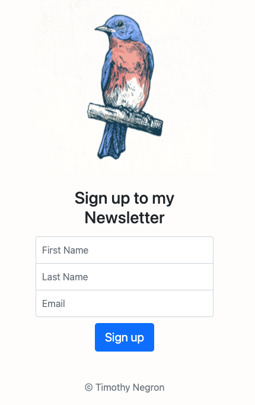
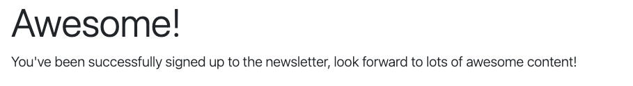
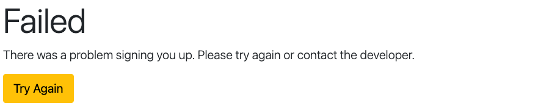

# Newsletter App

A Web App that allows users to sign up to subscribe to a newsletter.

### `References`

1. [Mailchimp](https://mailchimp.com/)
2. [Bootstrap Examples](https://getbootstrap.com/docs/4.0/examples/)
3. [Heroku](https://www.heroku.com/)

### `Built With`

1. HTML, CSS, JavaScript
2. BootStrap
3. Express
4. Nodemon
5. Mailchimp API
6. Heroku

### `Topics Covered`

1. Posting Data to external Server via API
2. Adding Success and Failure Pages
3. Deploying a Server with Heroku
4. APIs

### `Images`

##### Front page

##### Successfully Subscribed

##### Failed to Subscribe

### `Mailchimp`

1. Create an account
2. Get API Key
3. Install Client library (not needed)
4. Make API call to test
5. Get List ID
6. Add user to list

### `Heroku`

1. Create an account
2. Install Heroku
3. Prepare the app
   1. process.env.PORT
   2. Procfile - web: node app.js (point to server code)
   3. Save to Git
4. Deploy the app
   1. Create a new app on heroku | heroku create
   2. push to server | git push heroku master

### `NOTES`

1. Need to add subscribers to a list
   * Look up how to do that with the API
   * Refer to documentation
   * Mailchimp gives you the ability to store subscribers/audience in a list
   * Need to create a list, then add
   * Unique list ID **needed** cause can create multiple list
   * Mailchimp List: CREATE | READ | EDIT | DELETE 

### `Git commands`

Removing prior commits:
1. git reset --hard [commit number]
2. git push --force